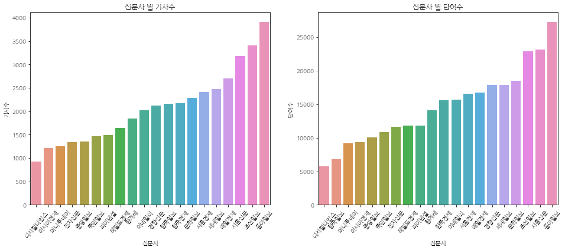
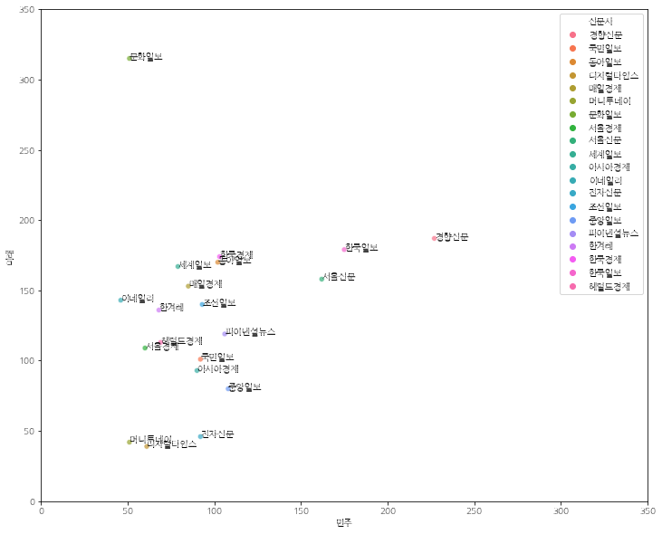

한글 폰트 설정

```python
!apt-get update -qq
!apt-get install fonts-nanum* -qq 
```

    
    


```python
!pip install konlpy
```

    
    
library import
```python
import nltk
from konlpy.tag import Kkma
from konlpy.tag import Hannanum
from wordcloud import WordCloud, STOPWORDS
from PIL import Image

import matplotlib.pyplot as plt
import matplotlib.font_manager as fm

import numpy as np
import matplotlib as mpl
```

한글 폰트 설치
```python
path = '/usr/share/fonts/truetype/nanum/NanumGothicEco.ttf'
font_name = fm.FontProperties(fname=path, size=10).get_name()
print(font_name)
plt.rc('font', family=font_name)
mpl.rcParams['axes.unicode_minus'] = False   # 음수 표시
```

    NanumGothic Eco
    

폰트 rebuild
```python
fm._rebuild()
```

파일 불러오기


```python
doc_ko = open('조선일보.txt').read()
```

워드클라우드용 마스크 설정


```python
mask = np.array(Image.open("셜록.jpg"))
```


```python
plt.figure(figsize=(15,8))
plt.imshow(mask,cmap=plt.cm.gray, interpolation='bilinear')
plt.axis('off')
plt.show()
```


워드클라우드 생성


```python
# OKT 클래스를 이용한 명사확인
from konlpy.tag import Okt
t = Okt()
doc_nouns = t.nouns(doc_ko)

ko = nltk.Text(doc_nouns, name="조선일보")
# print(type(ko))
# print(len(ko.tokens))

stop_words = ['것','이','고','전','연','군','의','수','등','비','안','명','선','중','때문',
              '경향신문','국민일보','동아일보','디지털타임스','매일경제','머니투데이',
              '문화일보','서울경제','서울신문','세계일보','아시아경제','이데일리','전자신문',
              '조선일보','중앙일보','파이낸셜뉴스','한겨레','한국경제','한국일보','헤럴드경제',
              '오늘','뉴스','종합','속보','단독','선택','포토','미아','인터뷰']   # 불용어 사전
new_ko = [ ]        # 가용어 사전
for one_word in ko:
  if one_word not in stop_words:  # 불용어가 아닌 것
    new_ko.append(one_word)       # 추가
new_ko = nltk.Text(new_ko, name='조선일보')

# 빈도수 높은 단어 1000개 추출
data2 = new_ko.vocab().most_common(1000) 

# 워드 클라우드 표현을 위한 데이터 생성
wc = WordCloud(background_color='white',
    max_words=1000,
    mask=mask,
    contour_width=0,
    font_path=path).generate_from_frequencies(dict(data2))   # 불용어 빼고 단어의 빈도로

plt.figure(figsize=(20,20))
plt.imshow(wc)
plt.axis("off")
plt.show()
```


단어들의 사용 횟수 확인 (빈도분석)


```python
most_fre = new_ko.vocab().most_common(50)
most_fre
```


    [('한국', 293),
     ('대통령', 267),
     ('통합', 140),
     ('정부', 126),
     ('비례', 123),
     ('조국', 117),
     ('총선', 109),
     ('출마', 100),
     ('공천', 98),
     ('김정은', 98),
     ('민주당', 93),
     ('황교안', 88),
     ('트럼프', 82),
     ('검찰', 71),
     ('의원', 67),
     ('선거', 67),
     ('국회', 65),
     ('수사', 62),
     ('때', 58),
     ('국민', 58),
     ('안철수', 57),
     ('코로나', 56),
     ('우리', 55),
     ('논란', 55),
     ('선거법', 54),
     ('당', 53),
     ('대표', 53),
     ('정치', 52),
     ('총리', 52),
     ('이해찬', 51),
     ('땐', 50),
     ('방위', 50),
     ('보수', 50),
     ('석', 49),
     ('은', 48),
     ('인사', 47),
     ('듯', 46),
     ('또', 46),
     ('이낙연', 46),
     ('말', 45),
     ('유승민', 45),
     ('후보', 45),
     ('의혹', 44),
     ('위', 44),
     ('제', 44),
     ('김종인', 43),
     ('장관', 43),
     ('불', 43),
     ('더', 43),
     ('정권', 43)]


```python
plt.figure(figsize=(12,6))
ko.plot(50)
plt.show()
```


신문사 별 기사수, 단어수 시각화


```python
import pandas as pd
import seaborn as sns

df = pd.read_csv('기사수2.csv', encoding='cp949')
df = df.iloc[:20,:]

plt.figure(figsize=(16,6))
plt.subplot(1,2,1)
plt.title('신문사 별 기사수')
df.sort_values(by=['기사수'], ascending=True, axis=0, inplace=True)
sns.barplot(x='신문사', y='기사수', data=df)
plt.xticks(rotation=50)

plt.subplot(1,2,2)
plt.title('신문사 별 단어수')
df.sort_values(by=['단어수'], ascending=True, axis=0, inplace=True)
sns.barplot(x='신문사', y='단어수', data=df)
plt.xticks(rotation=50)
```


    (array([ 0,  1,  2,  3,  4,  5,  6,  7,  8,  9, 10, 11, 12, 13, 14, 15, 16,
            17, 18, 19]), <a list of 20 Text major ticklabel objects>)





신문사 별 민주당 vs 미래당(통합당) 언급 수에 따른 scatter plot
* 진보 : 민주당
* 보수 : 미래당, 통합당


```python
dat = pd.read_csv('민주vs미래.csv', encoding='cp949')
dat['total'] = dat.민주 + dat.미래
# label = dat.신문사.to_list()

plt.figure(figsize=(12,10))
plt.xlim(0,350)
plt.ylim(0,350)
sns.scatterplot(x='민주', y='미래', hue='신문사', alpha=.7, data=dat)

for i in range(20):
  plt.text(dat.민주[i], dat.미래[i], dat.신문사[i])

plt.legend(loc='upper right')

plt.show()
```





```python

```
