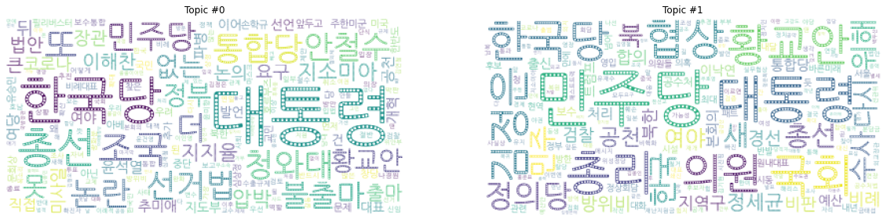

## 00. 사전작업


```python
!pip install wordcloud
```


```python
!pip install konlpy
```


```python
import matplotlib as mpl              # 기본 설정 만지는 용도
import matplotlib.pyplot as plt       # 그래프 그리는 용도
import matplotlib.font_manager as fm  # 폰트 관련 용도
```


```python
from gensim import corpora
from gensim import models
```


```python
### 나눔 고딕 설치
!apt-get update -qq    # -qq 로그를 최소한으로 하여 설치를 업데이트 
!apt-get install fonts-nanum*  -qq
```


```python
# !ls -ltr /usr/share/fonts/truetype
path = '/usr/share/fonts/truetype/nanum/NanumGothicEco.ttf'
font_name = fm.FontProperties(fname=path, size=10).get_name()
print(font_name)
plt.rc('font', family=font_name)
```

    NanumGothic Eco
    


```python
doc_ko = open("경향_동아_조선_한겨레.txt").read()
#doc_ko
```


```python
import konlpy
from konlpy.tag import Kkma

kkma = Kkma()
docs = doc_ko.split('\n')
type(docs)
```


    list


```python
# 불용어 제거
stoplist = ('.!?, 것, 이, 고, 전, 연, 군, 의, 수, 등, 비, 안, 명, 선, 중, 첫, 때문, 경향신문, 동아일보, 조선일보, 한겨레, 오늘, 뉴스, 종합, 속보, 단독, 선택, 포토, 미아, 인터뷰')

# 단어 리스트 만들기
texts = [
    [word for word in document.split() if word not in stoplist]
    for document in docs]
#texts
```

단어 리스트에서 한글만 추출


```python
import re

hangul = re.compile('[^ ㄱ-ㅣ가-힣]+') # 한글과 띄어쓰기를 제외한 모든 글자
result = []
for i in range(len(texts)):
  x = []
  for j in range(len(texts[i])):
    a = hangul.sub('', texts[i][j]) # 한글과 띄어쓰기를 제외한 모든 부분을 제거
    x.append(a)
  result.append(x)
#result
```

## 01. 사전(dictionary)과 말뭉치(corpus) 만들기

### 사전만들기
* dictionary는 bag-of-words를 이용하여 생성된 단어와 그 발생횟수를 나열


```python
dictionary = corpora.Dictionary(result)
dictionary
```


    <gensim.corpora.dictionary.Dictionary at 0x7f1d511ff6a0>


### 코퍼스 만들기(벡터화)
*  doc2bow()는 unique한 결과에서 단어의 출연횟수를 계산
* 문서마다 단어ID와 그 발생빈도를 갖는 튜플 생성


```python
corpus = [dictionary.doc2bow(text) for text in texts]
#print ('corpus : {}'.format(corpus))
```

## 02. 모델 구축
* LDA 모델 정의 : 기본적으로 corpus, num_topics, id2word 로 정의해야 한다.
* num_topics = 주제 갯수
* random_state 지정을 통해 임의의 값을 적용


```python
lda = models.ldamodel.LdaModel( corpus=corpus,
        id2word=dictionary,
        num_topics=2,
        random_state = 1)
```

## 03. 모델을 사용해 결과 출력


```python
# 주제마다 출현 확률이 높은 단어 순으로 출력
for t in lda.show_topics():
  print(t)
```

    (0, '0.013*"대통령" + 0.007*"한국당" + 0.004*"총선" + 0.003*"조국" + 0.003*"또" + 0.002*"청와대" + 0.002*"더" + 0.002*"통합당" + 0.002*"민주당" + 0.002*"논란"')
    (1, '0.007*"민주당" + 0.004*"대통령" + 0.003*"총리" + 0.003*"국회" + 0.003*"한국당" + 0.003*"황교안" + 0.003*"의원" + 0.003*"협상" + 0.003*"김정은" + 0.003*"정의당"')
    

## 04. 워드클라우드로 시각화


```python
import matplotlib.pyplot as plt
from wordcloud import WordCloud

path = '/usr/share/fonts/truetype/nanum/NanumGothicEco.ttf'
wc = WordCloud(background_color="white",
    max_words=2000,
    contour_width=3, contour_color='steelblue',
    font_path=path)
```


```python
lda.num_topics
```


    2


```python
plt.figure(figsize=(20,30))
for t in range(lda.num_topics):
  plt.subplot(1,2,t+1)
  x = dict(lda.show_topic(t,200))
  im = wc.generate_from_frequencies(x)
  plt.imshow(im)
  plt.axis("off")
  plt.title("Topic #" + str(t))
```




